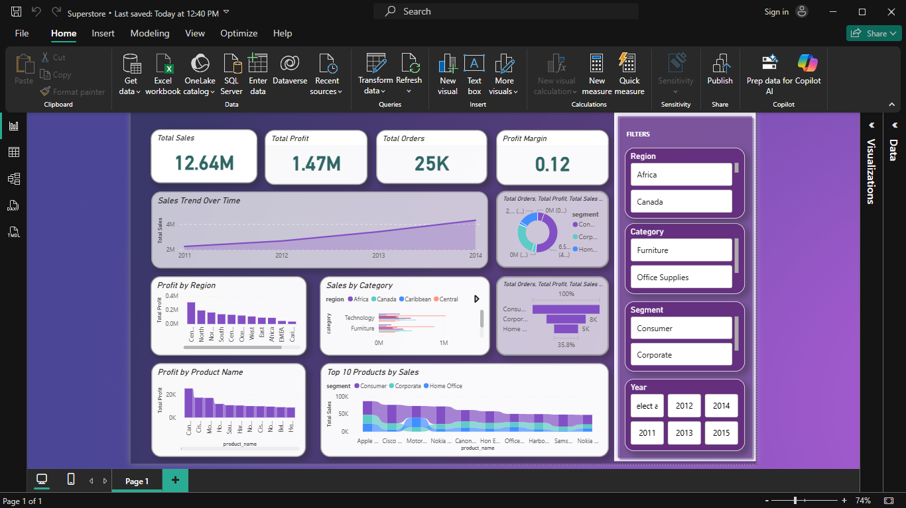

# Superstore Sales Dashboard (Power BI)

## Project Overview
This project presents an interactive sales dashboard built using Power BI. 
The dashboard analyzes sales performance across categories, regions, and products.

## Tools Used
- Power BI
- Data Visualization
- Business Intelligence

## Dataset
Superstore Sales Dataset

## Key Metrics
- Total Sales
- Total Profit
- Total Orders
- Profit Margin

## Dashboard Features
- Sales trend analysis
- Regional profit comparison
- Category sales breakdown
- Top 10 products by revenue
- Interactive slicers for filtering

## Dashboard Preview

## Key Insights
- Technology category generated the highest revenue.
- Certain regions contributed significantly more profit.
- A small group of products drives the majority of sales.

## Author
Elijah Kayode  
Aspiring Data Analyst
